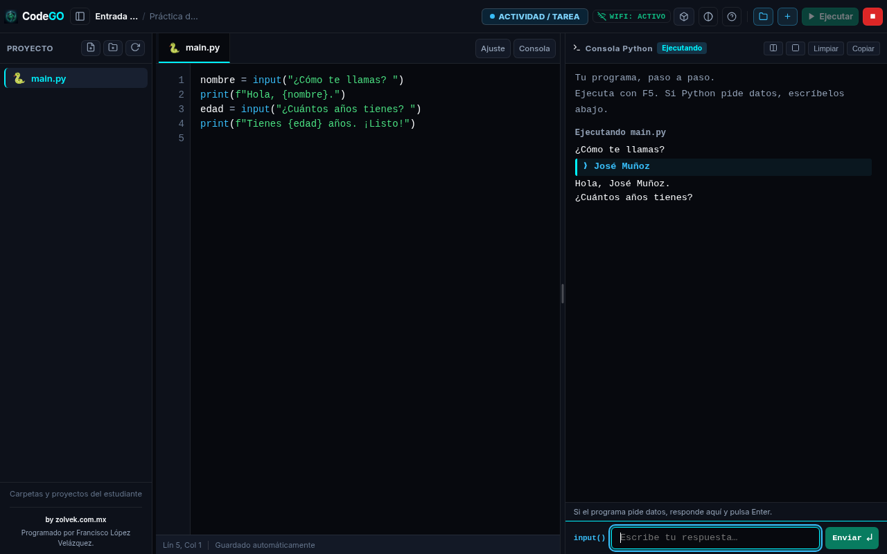

# CodeGO ExamGuard

[](https://github.com/f-lopez-velazquez/CodeGO/actions/workflows/verify.yml)
[](LICENSE)

**Python para aprender, practicar y evaluar.**

[Descargar CodeGO](https://zolvek.com.mx/productos/codego) · [Versiones y SHA-256](https://github.com/f-lopez-velazquez/CodeGO/releases) · [Compatibilidad](docs/VALIDACION_MULTIPLATAFORMA.md)

**by zolvek.com.mx**  
**Programado por Francisco López Velázquez.**

Editor educativo de Python para escritorio, desarrollado con Electron y JavaScript nativo. Incluye ejecución interactiva, archivos y proyectos, modo actividad y evaluación supervisada.

La respuesta a `input()` se escribe directamente junto al prompt de Python dentro de la terminal, sin barra ni cuadro separado. La ventana se adapta al área de pantalla disponible y al escalado del sistema; conserva visibles el pie del editor y los créditos. La consola conserva texto UTF-8, permite respuestas vacías y ejecuciones consecutivas. El guardado conserva los cambios pendientes cuando ocurre un error y se completa antes de ejecutar, entregar o cerrar normalmente.



## Descargar

| Sistema | Descarga directa 1.1.1 | Alternativa |
| --- | --- | --- |
| Windows x64 | [Instalador EXE](https://github.com/f-lopez-velazquez/CodeGO/releases/download/v1.1.1-preview.1/CodeGO-1.1.1-setup-x64.exe) | [Portable](https://github.com/f-lopez-velazquez/CodeGO/releases/download/v1.1.1-preview.1/CodeGO-1.1.1-portable-x64.exe) |
| Linux x64 | [AppImage](https://github.com/f-lopez-velazquez/CodeGO/releases/download/v1.1.1-preview.1/CodeGO-1.1.1-linux-x64.AppImage) | [tar.gz](https://github.com/f-lopez-velazquez/CodeGO/releases/download/v1.1.1-preview.1/CodeGO-1.1.1-linux-x64.tar.gz) |
| macOS Apple Silicon | [DMG ARM64](https://github.com/f-lopez-velazquez/CodeGO/releases/download/v1.1.1-preview.1/CodeGO-1.1.1-mac-arm64.dmg) | [ZIP ARM64](https://github.com/f-lopez-velazquez/CodeGO/releases/download/v1.1.1-preview.1/CodeGO-1.1.1-mac-arm64.zip) |
| macOS Intel | [DMG x64](https://github.com/f-lopez-velazquez/CodeGO/releases/download/v1.1.1-preview.1/CodeGO-1.1.1-mac-x64.dmg) | [ZIP x64](https://github.com/f-lopez-velazquez/CodeGO/releases/download/v1.1.1-preview.1/CodeGO-1.1.1-mac-x64.zip) |

**Vista previa pública:** Windows y macOS todavía no tienen certificado de desarrollador; macOS no está notarizado. Los sistemas pueden advertir o bloquear su apertura. Consulta [distribución y aceptación](docs/PRODUCCION.md) antes de usarlo en evaluaciones. Python se instala por separado.

## Usar la aplicación

1. Instala Python 3 con `pip` y `venv`. La matriz de comprobación contempla Python 3.12 y 3.13; usa un parche actualizado. Python y las librerías científicas **no vienen dentro del ejecutable**.
2. Abre CodeGO y pulsa **Comprobar este equipo**. La prueba crea y lee un archivo temporal, ejecuta Python, responde a `input()` con acentos y elimina sus archivos.
3. Elige **Actividad / Tarea** para programar libremente. No aparece el botón Entregar y no se modifican Wi-Fi ni audio.
4. Abre un proyecto, escribe código y pulsa **F5 / Ejecutar**. Escribe directamente en la consola y envía con Enter. El botón Detener termina el proceso Python principal.

En Linux, da permiso de ejecución al AppImage (`chmod +x CodeGO-1.1.1-linux-x64.AppImage`) y ábrelo. Si tu sistema no admite AppImage, extrae el paquete `tar.gz`. Los binarios no requieren Node.js instalado.

La herramienta de librerías instala dentro de `exam_env`; si no puede crear o verificar ese entorno, muestra el error y no usa pip global. La instalación de componentes requiere conexión y puede requerir permisos del administrador. En distribuciones sin `apt-get` y en macOS, prepara Python con las herramientas de tu sistema.

## Configurar un examen

El administrador debe definir `CODEGO_TEACHER_PIN` antes de iniciar CodeGO: al menos ocho caracteres, distinto del antiguo PIN público. No guardes la clave en este repositorio ni en los archivos del alumno. La ventana de autorización ya no muestra una clave predeterminada. Actividad no necesita PIN.

Examen verifica la desconexión de Wi-Fi antes de activar kiosk. Si no puede comprobarla, no inicia la sesión. Al salir con autorización o entregar restaura únicamente las interfaces que modificó. En Linux necesita NetworkManager (`nmcli`); Windows requiere permisos para administrar adaptadores y macOS usa `networksetup`.

La entrega genera un ZIP con código, bitácora y SHA-256 por archivo, además de un archivo `.zip.sha256`. Para comprobar ambos:

```bash
npm run verify:submission -- "/ruta/EXAMEN_alumno.zip"
```

Los hashes comprueban integridad respecto al checksum conservado por el docente; no cifran el ZIP ni autentican a su autor. Python ejecuta con los permisos del usuario: kiosk no sustituye el aislamiento y las políticas del sistema operativo. Para evaluaciones supervisadas aplica la aceptación física descrita en [PRODUCCION.md](docs/PRODUCCION.md).

## Desarrollo y comprobación

Usa Node.js 22, con la versión fijada en `.nvmrc`, y Python disponible en PATH:

```bash
npm ci
npx playwright install chromium
npm run verify
npm run build:dir
npm run test:packaged
npm start
```

En Linux de CI se instalan las dependencias de Chromium con `npx playwright install --with-deps chromium`. Si ya existe un Chromium administrado, `CODEGO_BROWSER_BINARY` permite indicar su ruta para las pruebas. `CODEGO_TEST_PYTHON` permite seleccionar el intérprete de las pruebas unitarias y del harness Electron.

`verify` ejecuta sintaxis, pruebas unitarias, Electron con Python real, regresión visual/funcional en Chromium y auditoría de dependencias. `test:packaged` abre el programa compilado con un perfil temporal y comprueba su preload, IPC, archivos, Python y geometría de la entrada; genera JSON y captura en `reports/`. La prueba no activa kiosk ni modifica red/audio. El perfil de pruebas Linux sin pantalla usa `--no-sandbox`; el inicio normal mantiene el sandbox del renderer.

## Compatibilidad y distribución

La compatibilidad se comprueba por **sistema, arquitectura y versión**, no para cualquier sistema operativo imaginable. El flujo [verify.yml](.github/workflows/verify.yml) ejecuta seis trabajos nativos: Ubuntu 22.04/24.04 x64, Windows Server 2022/2025 x64, macOS 14 ARM64 y macOS 15 Intel. Los resultados reales, incluida una VM Windows 11 local, están en [VALIDACION_MULTIPLATAFORMA.md](docs/VALIDACION_MULTIPLATAFORMA.md). Estos trabajos verifican el núcleo de escritorio; no reemplazan pruebas físicas en el equipo del aula.

La página de descarga está incluida en [website/](website/README.md).

El flujo [release.yml](.github/workflows/release.yml) exige que la matriz pase, registra el acta de pruebas físicas y compila artefactos con SHA-256. Windows requiere certificado de firma; macOS requiere firma y notarización. No publica una versión automáticamente. Configuración, evidencia local y pendientes reales: [guía de producción](docs/PRODUCCION.md).

## Licencia y colaboración

[MIT](LICENSE) · [Contribuir](CONTRIBUTING.md) · [Seguridad](SECURITY.md) · [Cambios](CHANGELOG.md). Las dependencias conservan sus propias licencias.
