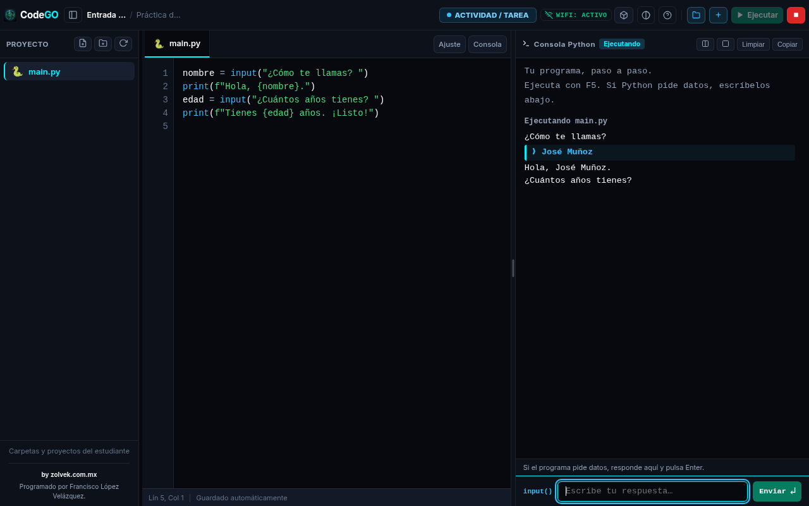

# codeGO

[](https://github.com/f-lopez-velazquez/CodeGO/actions/workflows/verify.yml)
[](LICENSE)

**Python para aprender, practicar y evaluar.**

[Descargar codeGO](https://zolvek.com.mx/productos/codego) · [Versiones y SHA-256](https://github.com/f-lopez-velazquez/CodeGO/releases) · [Compatibilidad](docs/VALIDACION_MULTIPLATAFORMA.md)

**by zolvek.com.mx**  
**Programado por Francisco López Velázquez.**

Editor educativo de Python para escritorio, desarrollado con Electron y JavaScript nativo. Incluye ejecución interactiva, proyectos locales, actividades, tareas certificadas y evaluación supervisada.

Cada sesión comienza eligiendo una carpeta existente o creando un proyecto vacío. codeGO no impone `main.py`: el estudiante decide la estructura y puede mover archivos o carpetas mediante arrastre dentro del explorador. El gestor de librerías permite buscar e instalar paquetes por nombre en el entorno privado de la aplicación.

La respuesta a `input()` se escribe directamente junto al prompt de Python dentro de la terminal, sin barra ni cuadro separado. La ventana se adapta al área de pantalla disponible y al escalado del sistema; conserva visibles el pie del editor y los créditos. La consola conserva texto UTF-8, permite respuestas vacías y ejecuciones consecutivas. El guardado conserva los cambios pendientes cuando ocurre un error y se completa antes de ejecutar, entregar o cerrar normalmente.



## Descargar

| Sistema | Descarga directa 1.4.1 autónoma | Alternativa |
| --- | --- | --- |
| Windows x64 | [Instalador EXE](https://github.com/f-lopez-velazquez/CodeGO/releases/download/v1.4.1/CodeGO-1.4.1-setup-x64.exe) | [Portable](https://github.com/f-lopez-velazquez/CodeGO/releases/download/v1.4.1/CodeGO-1.4.1-portable-x64.exe) |
| Linux x64 | [AppImage](https://github.com/f-lopez-velazquez/CodeGO/releases/download/v1.4.1/CodeGO-1.4.1-linux-x64.AppImage) | [tar.gz](https://github.com/f-lopez-velazquez/CodeGO/releases/download/v1.4.1/CodeGO-1.4.1-linux-x64.tar.gz) |
| macOS Apple Silicon | [DMG ARM64](https://github.com/f-lopez-velazquez/CodeGO/releases/download/v1.4.1/CodeGO-1.4.1-mac-arm64.dmg) | [ZIP ARM64](https://github.com/f-lopez-velazquez/CodeGO/releases/download/v1.4.1/CodeGO-1.4.1-mac-arm64.zip) |
| macOS Intel | [DMG x64](https://github.com/f-lopez-velazquez/CodeGO/releases/download/v1.4.1/CodeGO-1.4.1-mac-x64.dmg) | [ZIP x64](https://github.com/f-lopez-velazquez/CodeGO/releases/download/v1.4.1/CodeGO-1.4.1-mac-x64.zip) |

Cada instalador 1.4.1 lleva Python 3.13 y 28 librerías versionadas dentro. La primera apertura prepara y comprueba el entorno sin internet antes de habilitar el editor. Si una operación se interrumpe, codeGO reintenta y conserva el avance; también permite reconstruir sus componentes sin borrar proyectos ni entregas. En Linux, el lanzador protege el arranque frente a variables globales de Electron y, en Hyprland, mantiene las ventanas de Pygame y otras interfaces en el espacio de trabajo activo. Windows y macOS todavía no tienen certificado de desarrollador; macOS no está notarizado, por lo que el sistema puede advertir o bloquear su apertura. Consulta [distribución y aceptación](docs/PRODUCCION.md) antes de usarlo en evaluaciones.

## Modalidades de Trabajo

1. **🛡️ Modo Examen Blindado**: Kiosk absoluto a pantalla completa, Wi-Fi deshabilitado automáticamente, watchdog de audio anti-silenciamiento y alerta estroboscópica de 12 segundos ante cualquier intento de cambio de ventana. Entrega sellada en ZIP auditado con sello SHA-256.
2. **📦 Modo Tarea Certificada (Prueba de Autoría Irrefutable)**:
   - **Anticopia estricto**: Prohíbe el pegado de código externo (`ctrl+v`, menús contextuales). Todo el código debe ser digitado directamente en codeGO.
   - **Supervisión académica**: Modo kiosk y alarma visual/acústica si se intenta cambiar a otras aplicaciones o navegadores (ChatGPT, editores externos, etc.).
   - **Telemetría forense continua**: Registra pulsaciones de teclas, caracteres digitados, tiempo activo de tipeo, 0 intentos de pegado externo, ejecuciones de prueba e incidencias.
   - **Contenedor `.codego` firmado con HMAC-SHA256**: Certificado criptográfico irrefutable + reporte visual auto-contenido `CERTIFICADO_DOCENTE.html`.
3. **📘 Modo Actividad / Tarea Libre**: Entorno de programación sin restricciones para prácticas en clase o casa. Los botones de entrega (`#btn-finish-exam` y `#btn-submit-task`) permanecen estrictamente ocultos.

## Manejo de Carpetas y Subcarpetas

codeGO incluye un explorador de archivos con soporte integral de jerarquías de carpetas y subcarpetas:
- Árbol jerárquico colapsable/expandible con ordenamiento natural (carpetas primero).
- Movimiento de archivos y carpetas mediante arrastre, con validación de destino y conservación de pestañas abiertas.
- Creación rápida de archivos y subdirectorios dentro de cualquier nivel.
- Barra de navegación por migas de pan (`Breadcrumbs`) que indica la ruta relativa en tiempo real.
- Compatibilidad multiplataforma transparente (rutas normalizadas en Linux, Windows y macOS).
- Botón para agregar imágenes, sonidos y datos a `recursos/`; los binarios no se abren como texto ni se corrompen.

## Ayuda, errores y hardware

F1 abre un centro de ayuda con buscador para instalación, terminal, recursos externos, errores y Arduino/ESP32. Los errores de Python se muestran con el mensaje original, una explicación, acciones concretas y un acceso directo a la línea afectada. El editor completa pares y facilita la sangría de bloques. PySerial, PyFirmata2, PyUSB, esptool, SMBus2 y GPIO Zero forman parte del entorno incluido; los controladores USB específicos de cada placa siguen correspondiendo al fabricante y al sistema operativo.

## Herramienta Forense para Docentes (`🔍 Verificar Tarea/Examen`)

Disponible en el lobby y dentro del IDE:
- Permite arrastrar o examinar archivos `.codego` o `.zip`.
- Verifica la firma criptográfica HMAC y los hashes SHA-256 de cada archivo individual y del contenedor.
- Despliega tarjeta del estudiante, telemetría de digitación auditada, visor de código con resaltado y botón para **ejecutar el código entregado** o **extraerlo limpiamente**.

## Desarrollo y comprobación

Usa Node.js 22, con la versión fijada en `.nvmrc`, y Python disponible en PATH:

```bash
npm ci
npx playwright install chromium
npm run verify
npm run prepare:offline
npm run build:dir
npm run test:packaged
npm start
```

En Linux de CI se instalan las dependencias de Chromium con `npx playwright install --with-deps chromium`. Si ya existe un Chromium administrado, `CODEGO_BROWSER_BINARY` permite indicar su ruta para las pruebas. `CODEGO_TEST_PYTHON` permite seleccionar el intérprete de las pruebas unitarias y del harness Electron.

`verify` ejecuta sintaxis, pruebas unitarias, Electron con Python real, regresión visual/funcional en Chromium y auditoría de dependencias. `test:packaged` abre el programa compilado con un perfil temporal y comprueba su preload, IPC, archivos, Python y geometría de la entrada; genera JSON y captura en `reports/`. La prueba no activa kiosk ni modifica red/audio. El perfil de pruebas Linux sin pantalla usa `--no-sandbox`; el inicio normal mantiene el sandbox del renderer.

## Compatibilidad y distribución

La compatibilidad se comprueba por **sistema, arquitectura y versión**, no para cualquier sistema operativo imaginable. El flujo [verify.yml](.github/workflows/verify.yml) ejecuta seis combinaciones nativas: Ubuntu 22.04/24.04 x64, Windows Server 2022 x64 con Python 3.12 y 3.13, macOS 14 ARM64 y macOS 15 Intel. Otros tres trabajos reproducen el primer inicio sin internet. Los resultados reales, incluida una VM Windows 11 local, están en [VALIDACION_MULTIPLATAFORMA.md](docs/VALIDACION_MULTIPLATAFORMA.md). Estos trabajos verifican el núcleo de escritorio; no reemplazan pruebas físicas en el equipo del aula.

La página de descarga está incluida en [website/](website/README.md).

El flujo [release.yml](.github/workflows/release.yml) exige que la matriz pase, genera el paquete autónomo propio de cada plataforma, prueba el instalador y publica artefactos con SHA-256 y procedencia. La distribución pública actual no tiene firma comercial ni notarización. Configuración, evidencia local y pendientes reales: [guía de producción](docs/PRODUCCION.md).

## Licencia y colaboración

[MIT](LICENSE) · [Contribuir](CONTRIBUTING.md) · [Seguridad](SECURITY.md) · [Cambios](CHANGELOG.md). Las dependencias conservan sus propias licencias.
